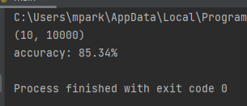
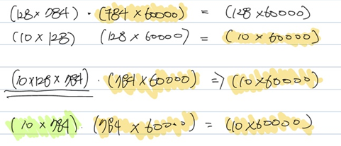

# lab

## nn_preparing
just a simple dnn model made only by numpy. 
mnist number classification 
you can see my past endeavor how i struggled with math in pdf file. 
build this model to do whatever i want

### main.py
tensorflow library has only used by downloading mnist data 
if you run you'll see 

### test.py
compare hand made model's accruracy vs. tf.keras model accruracy

## loss_function_experiment
### idea
not using a gradient descent to find a global minimum 
just set loss as 0, and back propagating using inversed matrix

#### result
make a single layer nn, (dnn) 

#### blocker
wanna make a two layer model (first output size 128, second output size 10) without doing gradient descent 
it's difficult to split 1 matrix to 2. 

 
I have yellow, I can make green, but not a freakin tensor (double line)

#### plan
make a 2 layer model first. (random number) 
do forward propagation. 
and think about what i can do with inversed matrix i got.

## fine tuner (not yet)
### idea
tweezering the weight.
